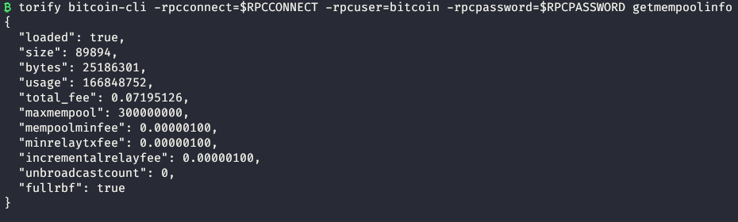
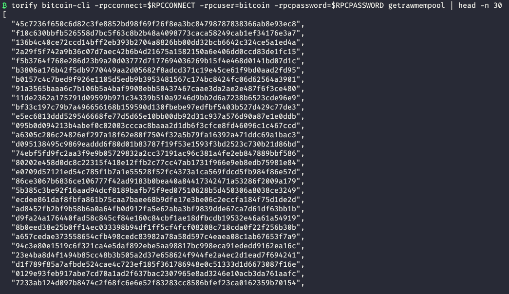
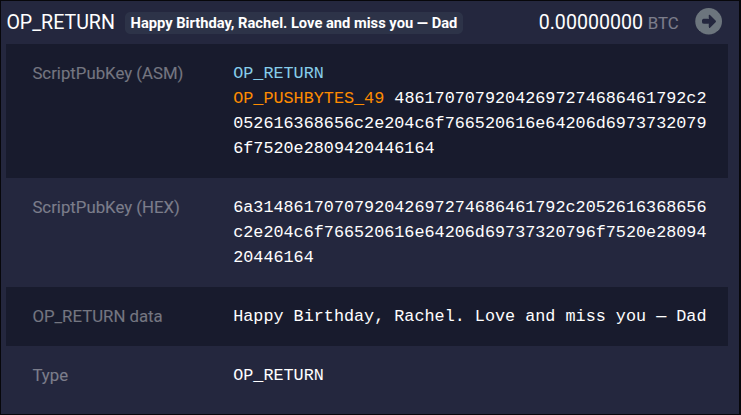
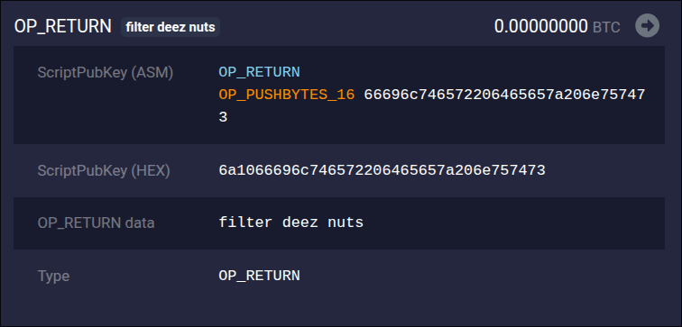
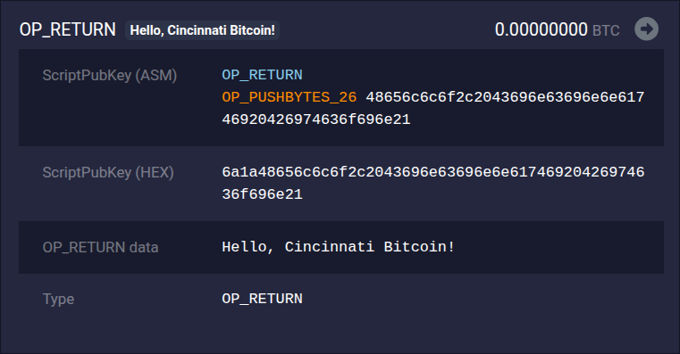

Who are you?
============

<!-- column_layout: [3,2] -->
<!-- column: 0 -->

- Twitter: @w3irdrobot
- GitHub: @w3irdrobot
- Nostr: w3ird@w3ird.tech

<!-- column: 1 -->


<!-- end_slide -->

Why are we here?
================

<!-- pause -->

Bitcoin Core v30 increased the `-datacarriersize` to 100,000 by default, which effectively uncaps the limit (as the maximum transaction size limit will be hit first).

<!-- pause -->
<!-- jump_to_middle -->
<!-- alignment: right -->

However, removing it has been controversial.

<!-- end_slide -->

Things we'll cover
==================

- The mempool, who decides what goes into it, and how that works
- Transaction relay and how transactions are filtered
- Bitcoin Script
- What `OP_RETURN` is
- Reasons for removing `OP_RETURN` limit
- Reasons for keeping `OP_RETURN` limit
- What you can do about it

<!-- speaker_note: |
  Make sure to check in after the slide to check everyone's familiarity with any of these topics
-->

<!-- end_slide -->

Things we won't cover
====================

- Core vs Knots
- JPEGs on the blockchain
- Dramatic tweets
- Ideology
- **My own opinion**

<!-- end_slide -->

The Mempool?
===========


<!-- pause -->

This is not the mempool.
=======================

<!-- end_slide -->

A Mempool
===========

<!-- column_layout: [1,1] -->
<!-- column: 0 -->



<!-- column: 1 -->



<!-- reset_layout -->

- A cache of valid bitcoin transactions that have been broadcast to the network but have yet to be confirmed in a block
- Every node has its own mempool
- Transactions are sent from node to node until all nodes' mempools contain the transaction
- This includes miners, who also run a node with their own mempools from which they build blocks
- A node will receive a new block, validate it, and then remove any transactions from its mempool that are included in the block
- It's like a waiting room for transactions, just waiting to be seen by the **block-tor**

<!--
speaker_note: |
    Default mempool size is 300mb
-->

<!-- end_slide -->

Transaction relay
================

- The rules around when a transaction will be added to the mempool and sent to other nodes
- Reasons for not relaying a transaction
  - Fail policy checks (filters)
  - Fail replacement checks
  - Fail consensus checks

<!-- pause -->

# What are filters?

- User-controlled rules for determining if a transaction should be added to the local mempool
- Bitcoin Core ships with a set of default filters
- Examples
  - Minimium fee rate
  - Replace-by-fee
  - Dust limit
  - Data carrier size

<!-- end_slide -->

Bitcoin Script
==============

- A simple, stack-based scripting system for defining the conditions under which a transaction output can be spent
- Used in the ScriptPubKey and ScriptSig of a transaction
- It is evaluated from left to right and is purposefully not Turing complete
- Each program is a list of instructions called op codes
- These op codes are well defined and limited to a small set of operations
- One of the well-known op codes is `OP_RETURN`

<!-- end_slide -->

What is OP_RETURN?
=================

- A Bitcoin Script op code that can be used to store data inside transactions
- Immediately ends the execution of the script and marks it as invalid, making the output **provably unspendable**
- Also used to refer to a standard script pattern used for storing arbitrary data inside transactions

<!-- speaker_note:
  - Provably unspendable is the key word
  - To keep nodes running performantly, we want to minimize what it has to keep track of
    - This includes the UTXO set
  - Since these are provably unspendable, we can validate them and then forget about them
-->

<!-- pause -->

```
OP_RETURN
OP_PUSHBYTES_11
68656c6c6f20776f726c64
```

<!-- speaker_note: |
- hex is "hello world"
-->

<!-- pause -->

## Uses:

- Storing ASCII text
- Commit to Merkle roots representing document or file hashes (OpenTimestamps)
- Proposed identity schemes that commit public keys or challenge-response data via `OP_RETURN` (DID btcr2 method)
- Signaling and sidechain coordination messages (Drivechain)

<!-- end_slide -->

OP_RETURN examples
==================



<!-- alignment: center -->

https://mempool.space/tx/a45497518d0a35e855728cc25f0d65de95c4dd9ebc9878bbf02c686f8c9208aa

<!-- end_slide -->

OP_RETURN examples
==================



<!-- alignment: center -->

https://mempool.space/tx/0c18049943842ba204356a75baa019e1942eeb1a495944955f4b42b00b6eb14a

<!-- end_slide -->

OP_RETURN examples
==================



<!-- alignment: center -->

https://mempool.space/tx/d1c8943df225c8ba028f121e8e0923ea7d55edb9fed2e3c83a3470dcba7c2ba4

<!-- end_slide -->

What's the controversy?
======================

# How it was

- Bitcoin Core originally introduced a locking script as a compromise to allow people to include arbitrary data inside transactions
- This signaled that the UTXO was unspendable
- The limit was set at 80 bytes
- Bitcoin Core v0.9.0 reduced this to 40 bytes and made this script standard
- Bitcoin Core v0.11.0 raised the limit to 80 bytes and added the `datacarriersize` flag
- Historically, Bitcoin Core’s 80-byte limit was seen as a compromise: large enough to store hashes and protocol identifiers, small enough to reduce the risk of abuse.

<!-- speaker_note: |
  The main difference between standard and non-standard is whether the transaction is relayed by default or not.
-->

<!-- pause -->

## How it is now

- Bitcoin Core v30 raised the limit to 100,000, effectively removing the limit entirely
- This means the limit is no longer set by a relay policy and instead is restricted purely by consensus rules

<!-- speaker_note: |
  Less than 100,000 bytes per script
  Less than 4MB per block
-->

<!-- end_slide -->

Reasoning for removing the limit
================================

<!-- pause -->

- Many legitimate use cases (like Merkle root proofs, cross-chain commits, or compact binary metadata) exceed 80 bytes

<!-- speaker_note:
  - Projects must split data across multiple transactions or compress data, adding unnecessary complexity.
  - Example: OpenTimestamps has to pack large Merkle roots carefully to stay under 80 bytes.
 -->

<!-- pause -->

- The OP_RETURN limit is a relay policy, not a consensus rule

<!-- speaker_note:
  Confused devs - transaction can be valid but still non-standard and therefore not relayed or mined by default nodes.
-->

<!-- pause -->

- Critics argue the 80-byte cap doesn't meaningfully reduce "spam"

<!-- speaker_note:
  - One of the original justifications for limiting OP_RETURN was to prevent “blockchain spam” — users storing arbitrary files or text on-chain.
  - However, it just pushes people toward worse methods (like fake multisig outputs) to store data.
  - The limit doesn't prevent abuse; it only penalizes legitimate structured use cases.
-->

<!-- pause -->

- Some miners and relay nodes profit from accepting high-fee, large OP_RETURN data transactions

<!-- speaker_note:
  - Creates policy fragmentation and unpredictable mempool behavior.
  - Reinforces centralization pressure since large miners can selectively mine “non-standard” payloads.
  - Hurts block validation performance and increases network overhead
    - If a transaction isn't in your mempool and it's added to a block, you now need to ask for it from peers to validate the whole block
-->

<!-- end_slide -->

Reasons for keeping the limit
=============================

<!-- pause -->

- Storing arbitrary data directly in Bitcoin blocks consumes space permanently

<!-- speaker_note:
  - Large or unlimited OP_RETURN outputs could significantly increase blockchain size, making full nodes heavier to run.
  - The blockchain is forever
-->

<!-- pause -->

- Without a limit, anyone could flood the network with huge OP_RETURN outputs

<!-- speaker_note:
  - The mempool could become clogged with low-fee “data spam” transactions.
-->

<!-- pause -->

- While OP_RETURN outputs are provably unspendable, very large outputs still contribute to transaction size and affect block propagation times

<!-- speaker_note:
  - Goes with the previous bullet point as well
  - Keeping a limit avoids excessive bandwidth and memory overhead in validating and relaying blocks.
 -->

<!-- pause -->

- A size limit forces developers to use compact, structured, and binary encodings rather than bloated ASCII strings or redundant data

<!-- speaker_note:
  - This encourages better design practices and more efficient data storage
  - It pushes developers to think about data structure and compression, leading to more efficient use of the blockchain
-->

<!-- end_slide -->

<!-- jump_to_middle -->

"I don't like it. What can I do?"
=================================

<!-- end_slide -->

<!-- new_lines: 8 -->
<!-- list_item_newlines: 3 -->

- Don't upgrade to Core v30

<!-- pause -->

- Use a different node implementation (Knots, btcd, etc.)

<!-- pause -->

- `-datacarriersize=83`

<!-- end_slide -->

<!-- jump_to_middle -->

Questions?
=========
